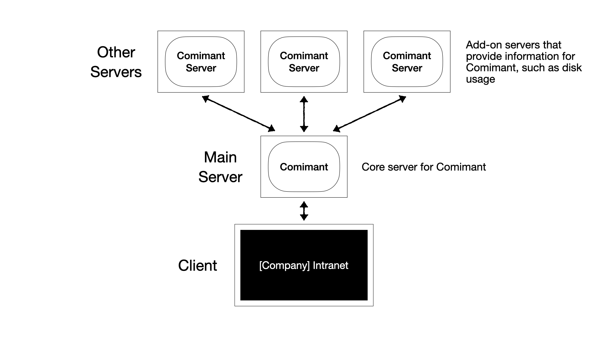
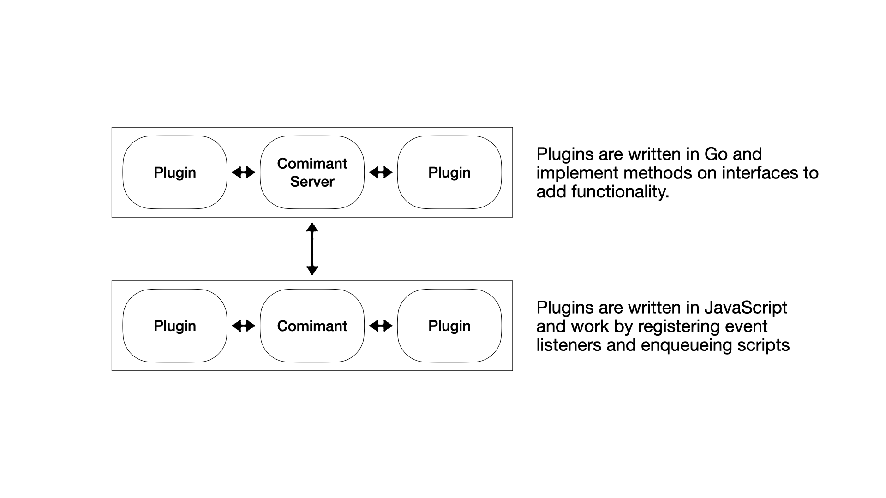

How it Works
============

The core Comimant package runs on Node.js, and allows HTTP clients to connect and 
access the resources on the intranet site running on Comimant.

Comimant can be paired with servers running Comimant Server, to retrieve information 
such as disk usage and other information. Comimant Server can run on the same server 
as Comimant.

Comimant can run on a single thread (PM2 fork mode), or on multiple threads simultaneously
(PM2 cluster mode). Because of this multi thread support, Comimant has to use a Redis
memory cache to make sure state data is the same across all server instances/threads.
More details on this is available on the multi-threading page of the Plugin documentation.

Comimant also relies on a MySQL database to store long-term data, such as user
details.

Comimant Server is written in Go, and uses the Comimant Protocol to transfer
information to and from Comimant.

Plugins
-------

Both Comimant and Comimant Server support plugins to add additional functionality.

Comimant plugins are written in JavaScript and work by registering event listeners 
and enqueueing scripts.

Comimant Server plugins are written in Go and are compiled as a shared object library.

The Comimant Protocol
---------------------

The Comimant Protocol is a fully encrypted secure protocol used to transfer messages 
and files between Comimant and Comimant Server.

For more details, see :doc:`/protocol`.